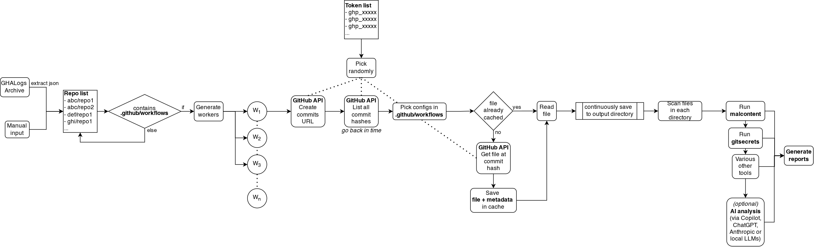

# Tracehound



**Tracehound** is a tool designed for automated analysis of repositories, workflows codebases and more and contextualize them using AI, focusing on discovering, tracking, and reporting sensitive information leaks.

---

## Overview

Tracehound automates the process of extracting workflow configurations, traversing commit histories, and scanning for secrets or policy violations across multiple repositories. It is optimized for security research and auditing scenarios.

---

## Features

- **Repository Workflow Extraction:**  
  Identifies repositories with GitHub Workflows (`.github/workflows`) for in-depth scanning.
- **Commit History Analysis:**  
  Utilizes the GitHub API to fetch all commit hashes, enabling deep, historical inspection of workflow files.
- **Caching Mechanism:**  
  Avoids redundant API requests and speeds up analysis by caching previously scanned workflow files and metadata.
- **Parallel Processing:**  
  Supports processing multiple repositories in parallel using worker queues.
- **Automated Secret Scanning:**  
  Runs tools such as `malcontent` and `git-secrets` on historical workflow configurations.
- **Pluggable AI Diagnostics (Optional):**  
  Allows integration with AI tooling (e.g., Copilot, ChatGPT, Anthropic, or local LLMs) for advanced workflow analysis.
- **Report Generation:**  
  Automatically compiles scan results and produces comprehensive security reports.

---

## Usage

```bash
python workflow_fetcher.py
```
